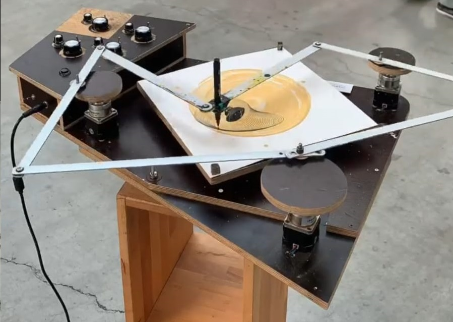
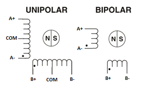
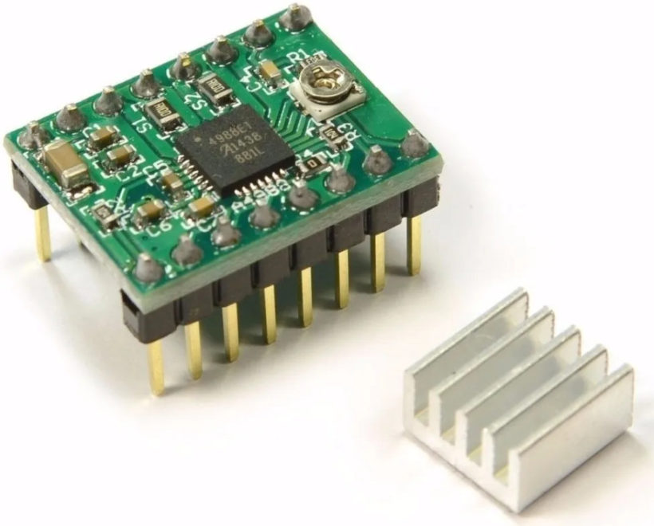
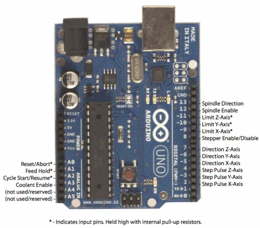
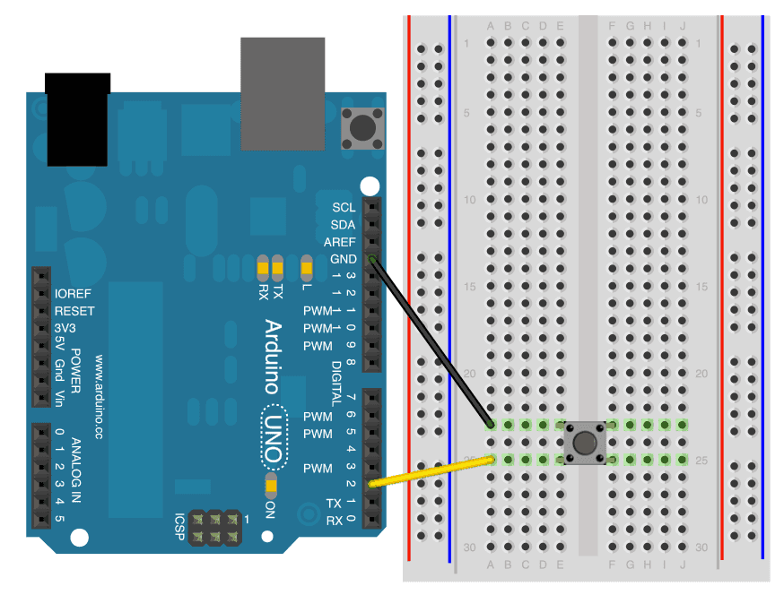

# Makinarte
# Proyecto Espacio Open Residencia 2022  
   

## Dia 1 con Ferdi 11.08.2022
**Masterclass sobre Steppers**  

Hay un tutorial completo sobre steppers en la web de Ferdi:  
http://feadi.de/es/tutorials/steppers/  

Primer concepto de los motores a pasos (steppers):  

### Unipolar y Bipolar  

   

Explicación de las diferencias entre ambos:  
https://blog.330ohms.com/2016/02/09/motores-a-pasos-unipolares-o-bipolares/  
https://es.wikipedia.org/wiki/Motor_paso_a_paso
  
Nosotros vamos a utilizar bipolar con 4 cables, por lo que nos hará falta un driver para poder ir haciendo las transmutaciones entre fases.    

#### _Para saber cada cable del motor a qué pertenece_  
  
Si tenemos los 4 cables del motor y no sabemos cuál es cuál, hay un varios trucos para saber si los cables son del mismo bobinado: 
- Si hacemos un cortocircuito entre 2 cables y al girar el motor con la mano está duro, eso quiere decir que esos cables son cada uno de los bordes de un bobinado.
- Si medimos la resistencia entre los cables, si la resistencia es infinito, quiere decir que son cables que no son del mismo bobinado. En el caso del motor unipolar también podremos saber cuál es la fase intermedia ya que la resistencia con esta conexión es la mitad que la bobina entera.
- Si conectamos una pila a los cables y hacen un pequeño giro, eso quiere decir que esos cables son del mismo bobinado.

### Driver A4988  

   

Conectamos las 4 salidas de los motores a estos drivers para que sea más fácil el manejo de los motores.  
El driver hace la función de ir transmutando la corriente en el bobinado del motor para que gire.  
Las entradas del driver son la dirección y la velocidad del motor, por lo que su control se facilita mucho.  

### Programa y placa Arduino  
Para el circuito con Arduino, se ha seguido un esquema muy simple que aparece en el siguiente link:

https://www.schmalzhaus.com/EasyDriver/Examples/EasyDriverExamples.html  

En el ejemplo aparece este código:

```
void setup() {               
  pinMode(8, OUTPUT);
  pinMode(9, OUTPUT);
  digitalWrite(8, LOW);
  digitalWrite(9, LOW);
}

void loop() {
  digitalWrite(9, HIGH);
  delayMicroseconds(1000);         
  digitalWrite(9, LOW);
  delayMicroseconds(1000);         
}
```
Con este programa se consigue que el motor gire a una velocidad muy reducida, ya que cada segundo cambia de paso (cada paso suelen ser unos 1.8º).  
  
  
## Dia 2 con Ferdi 22.08.2022
18:00 - 20:00h
Encontrado documentacion del Arduino CNC-shield:  
https://blog.protoneer.co.nz/arduino-cnc-shield/  

 

### Markdown (lenguaje de programación para crear textos con formato)
https://www.markdownguide.org/cheat-sheet/  

### Test Poti (Potenciómetro)
 - reconnectamos el cable de alimentacion
 - metimos los 3 jumpers para el microstepping en ejeX
 - ajustamos la corriente hasta 1V
 - descubrimos que el Microsecond delay va bien entre 50 y 2000us
 

Utilizamos el exemplo 

`File --> examples --> 01.Basics --> ReadAnalogVoltage`  

para testar el Poti.
Para ver los valores del Poti utilizamos el "serial monitor"
`Tools --> serial monitor`

https://www.arduino.cc/reference/es/language/structure/control-structure/switchcase/  

### Switch / Pull up
Se puede utilizar la resistencia incorporada (20K ohm) que tiene la placa de Arduino.  
Para ello, hay que activarla en el código (ver código abajo). Con este truco podemos evitar poner resistencias.  
Por ejemplo, en un circuito con un interruptor solamente, no sería necesario poner una resistencia si activamos la resistencia interna de Arduino.  

`Files --> Examples --> 02.Digital --> DigitalInputPullup`

Código para activar la resistencia (en el ejemplo en el pin 2):  
```
{
  pinMode(2, INPUT_PULLUP);
}
```  
Una vez activado, el interruptor se conecta a tierra (GND), ya que la resistencia interna está conectada a 5V  



 https://docs.arduino.cc/tutorials/generic/digital-input-pullup  

### Delay
La función Delay presenta un problema para nuestro proyecto, donde tenemos varios steppers con diferentes velocidades.  
La función Delay hace que, durante el periodo de tiempo indicado, Arduino quede en espera, que la placa no ejecute ninguna operación.  
De esta manera, si tenemos varios motores a diferentes velocidades, no podemos usar Delay, ya que habría que activar pines durante los Delays de otro motor. Hay que hacerlo con otra estrategia.

`Files --> Examples --> 02.Digital --> BlinkWithoutDelay`

```
unsigned long previousMillis = 0;  
const long interval = 1000;  

void loop() {
  unsigned long currentMillis = millis();

  if (currentMillis - previousMillis >= interval) {
    previousMillis = currentMillis;

    if (ledState == LOW) {
      ledState = HIGH;
    } else {
      ledState = LOW;
    }
```

## Dia 3 con Ferdi 23.08.2022  
### Prueba con Arduino con potenciometro y con un motor  
11:30 - 13:00h

Tipo interesgarria jarraitzeko: pighixxx

Sintaxis de Markdown: https://www.markdownguide.org/cheat-sheet/